# Testes Automatizados com Selenium e JUnit.

## Introdução

Sistema Distribuído do GRULES
Deverá ser o sistema distribuído para gerenciamento e organização dos projetos do Grules

## Teste web com Selenium

Teste com selenium das páginas web, realizar testes das páginas estáticas e dinâmicas.

1. Código que testa web (Aplicação Java que testa site web);
2. Testar toda interação com usuário cadastros (escrita) e listagens (leitura);

## Configurando Eclipse IDE para testes com Selenium WebDriver:

#### Criando novo Projeto

#### Criar Arquivo Biblioteca e adicionar bibliotecas do Selenium e Chorme

#### Adicionar todos novos patchs ao projeto Testeselenium

#### Novos patchs adicionados ao projeto Testeselenium

### Adicionado JUnit ao projeto

Adicionando ao biblioteca do Eclipse o JUnit5

#### Inserindo Biblioteca Testeselenium
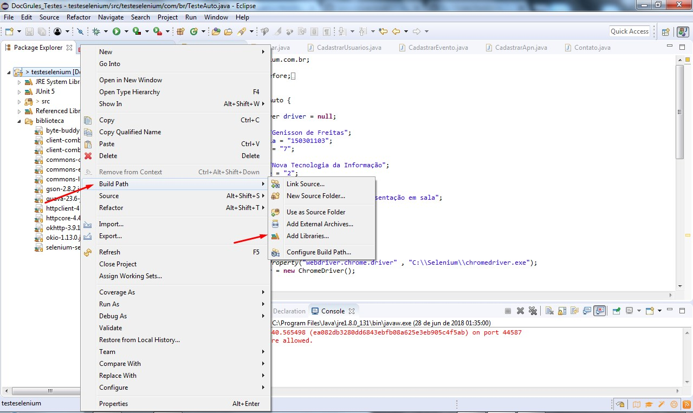
#### Localizando Junit5
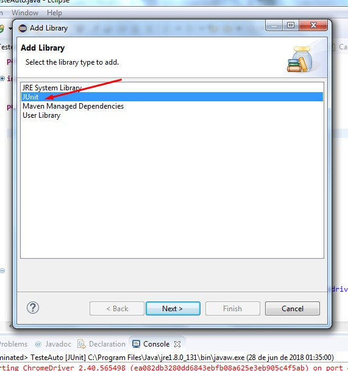

### Criando Classe TesteAuto - Selenium WebDriver

Criando Classe TesteAuto para configuração de testes com Selenium e JUnit

#### Criando Classe TesteAuto e configurando para abrir navegador Chrome
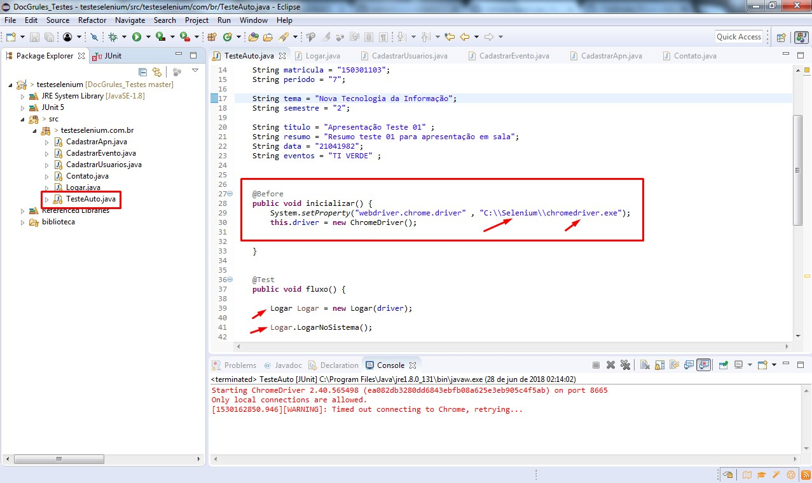
#### Criando Classe Logar e configurando primeiro teste de Login
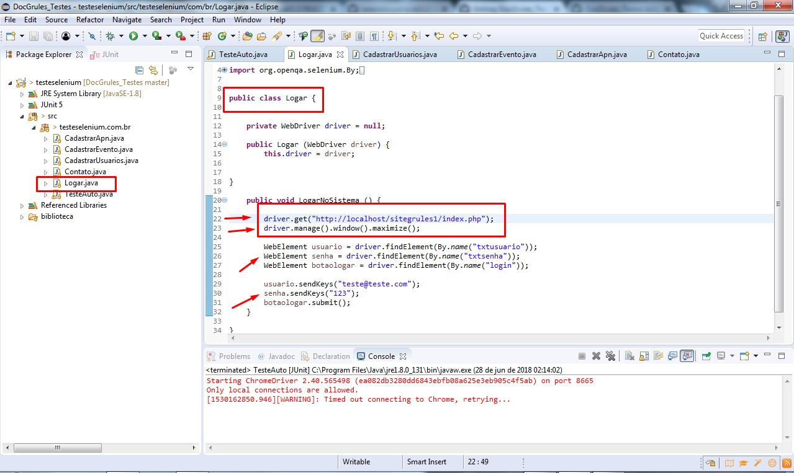

### Criando Classe CadastrarUsurios - Selenium WebDriver

Criando Classe CadastrarUsuarios para configuração de testes com Selenium e JUnit de cadastramento, alteração e remoção

#### Criando Classe CadastrarUsarios e configurando para rodar testes

#### Criando Classe Logar e configurando primeiro teste de Login

#### Configurando para rodar testes de Cadastramento de Usuários
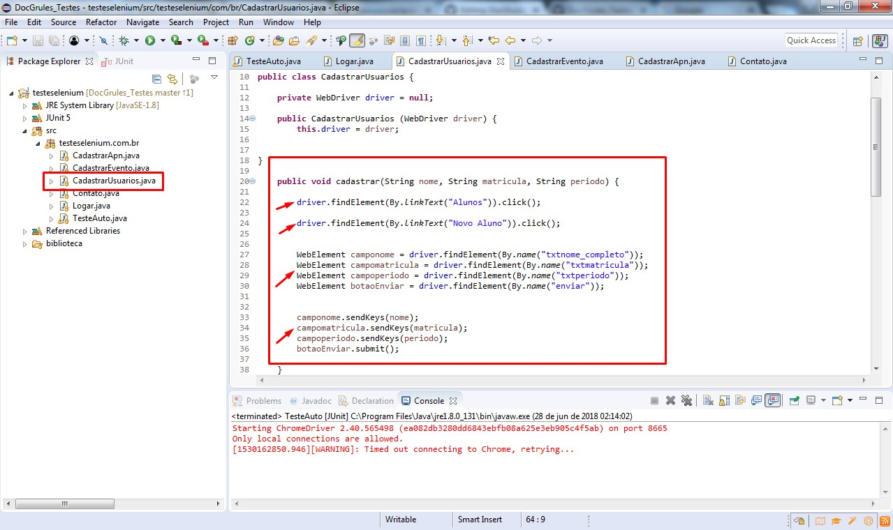
#### Configurando para rodar testes de Alteração de Usuários
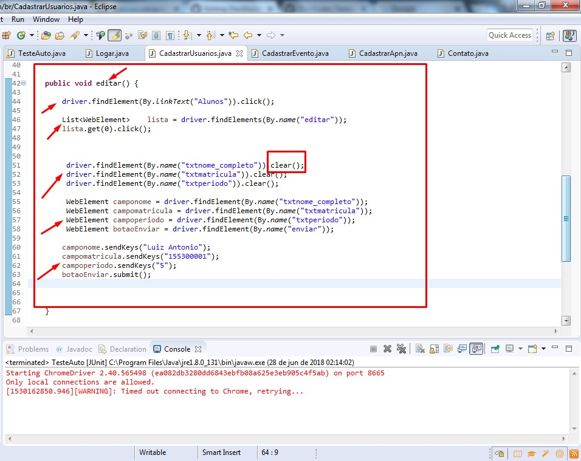

#### Configurando para rodar testes de Exclusão de Usuários
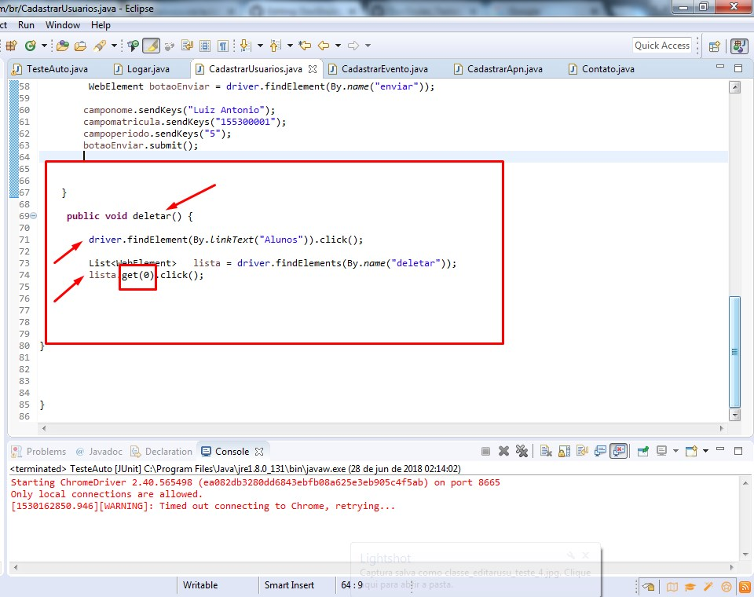

### Criando Classe CadastrarEventos - Selenium WebDriver

Criando Classe CadastrarEventos para configuração de testes com Selenium e JUnit de cadastramento, alteração e remoção

#### Criando Classe CadastrarEventos e configurando para rodar testes
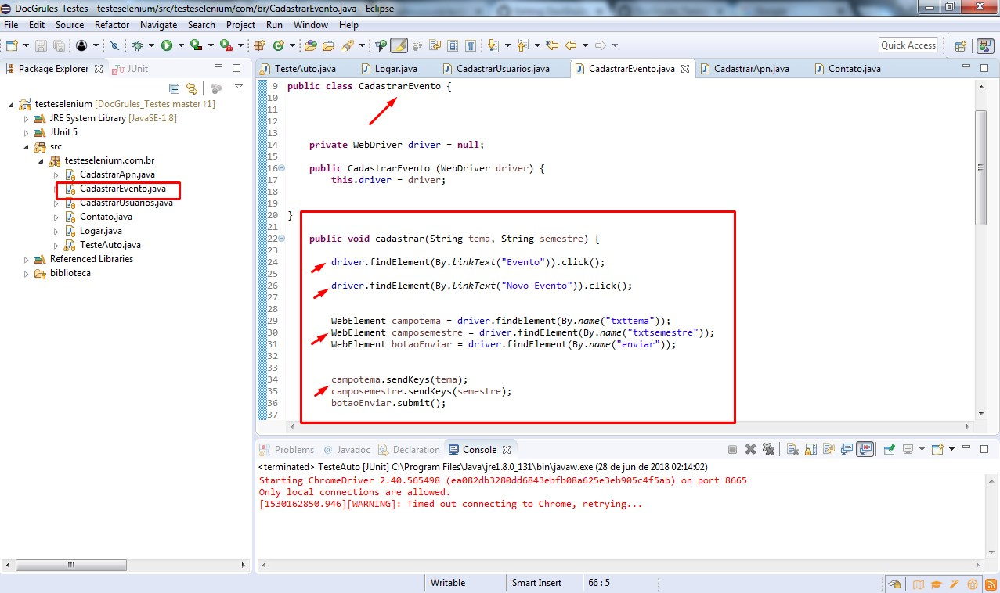
#### Mesmos métodos usados para editar e excluir eventos, já ultilizado para usuários
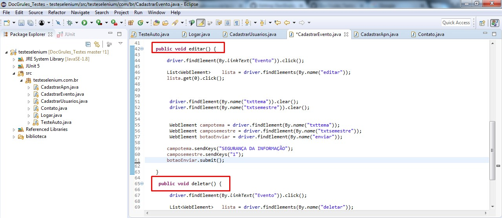

### Criando Classe CadastrarApn - Selenium WebDriver

Criando Classe CadastrarApn para configuração de testes com Selenium e JUnit de cadastramento, alteração e remoção

#### Criando Classe CadastrarApn e configurando para rodar testes
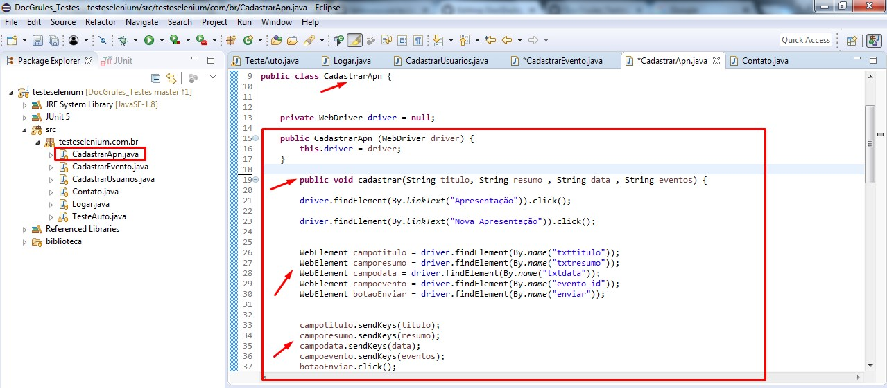
#### Mesmos métodos usados para editar e excluir eventos, já ultilizado para usuários
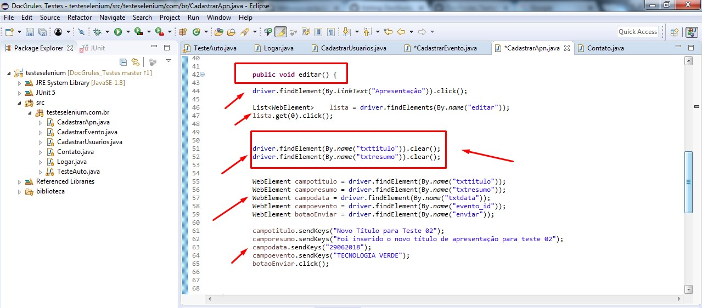
#### Criando método deletar e adicionar aluno ao grupo de Apresentação
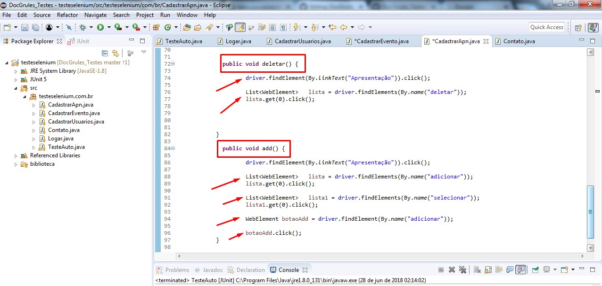

### Erros de testes realizados no menu Apresentação

Identificado erro no tetse da Classe CadastrarApn para configuração alteração e inserção de aluno

#### Erro ao editar Apresentação Cadastrada
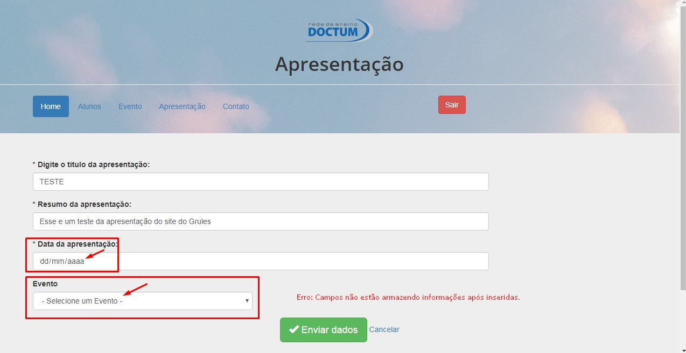
#### Erro ao tentar inserir aluno cadastrado no grupo de Apresentação
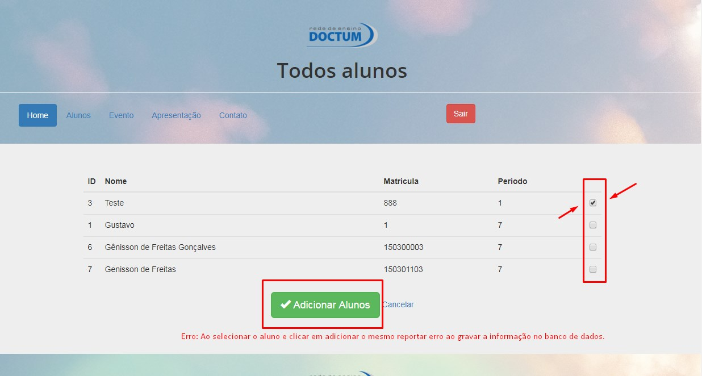
#### Erro ao tentar inserir novas informações no Banco de Dados
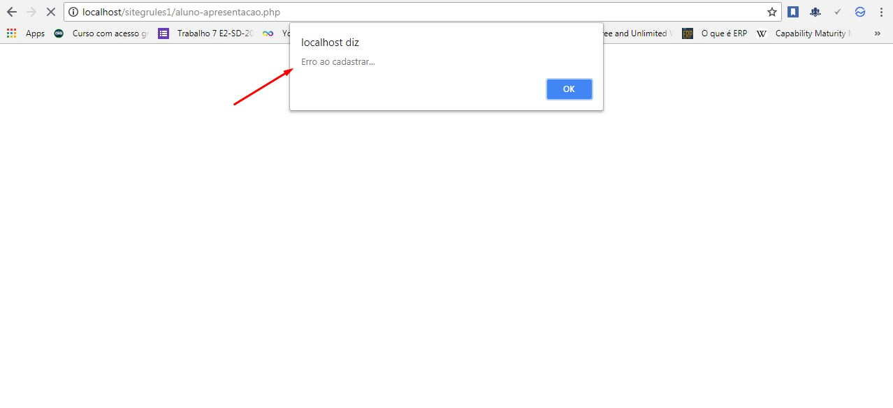

## Links

Os seguintes links abaixo serão úteis para você estudar sobre o tema de Automatização de testes com Selenium WebDriver

 - [Selenium WebDriver Config e Downloads](https://www.youtube.com/watch?v=2UhRVicIzGI)
 - [Introdução aos Testes Funcionais Automatizados com JUnit e Selenium WebDriver](https://www.devmedia.com.br/introducao-aos-testes-funcionais-automatizados-com-junit-e-selenium-webdriver/28037)
 - [Curso - Automação de Testes com Selenium WebDriver em Java](https://www.udemy.com/automacao-de-testes-com-selenium-webdriver-em-java/)

