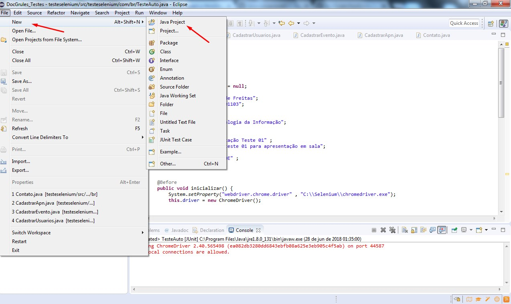
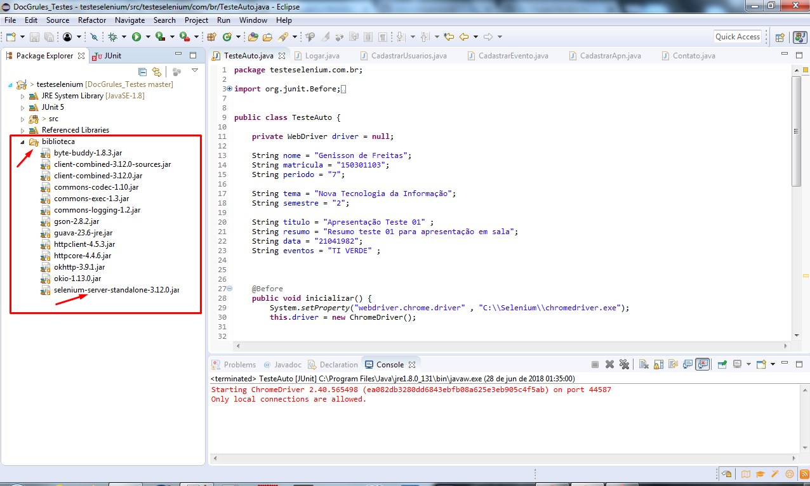
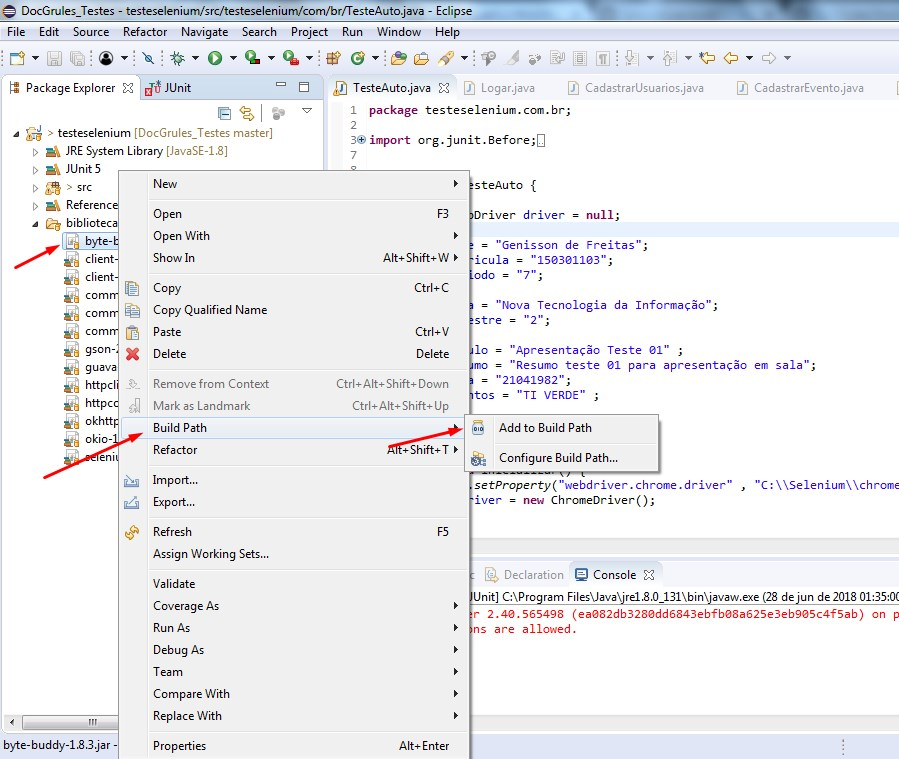
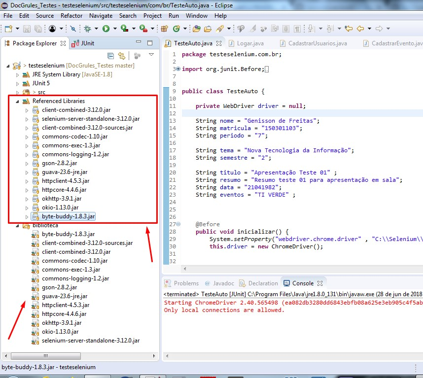

# Testes Automatizados com Selenium e JUnit.

## Introdução

Sistema Distribuído do GRULES
Deverá ser o sistema distribuído para gerenciamento e organização dos projetos do Grules

## Teste web com Selenium

Teste com selenium das páginas web, realizar testes das páginas estáticas e dinâmicas.

1. Código que testa web (Aplicação Java que testa site web);
2. Testar toda interação com usuário cadastros (escrita) e listagens (leitura);

## Configurando Eclipse IDE para testes com Selenium WebDriver:

#### Criando novo Projeto

#### Criar Arquivo Biblioteca e adicionar bibliotecas do Selenium e Chorme

#### Adicionar todos novos patchs ao projeto Testeselenium

#### Novos patchs adicionados ao projeto Testeselenium

